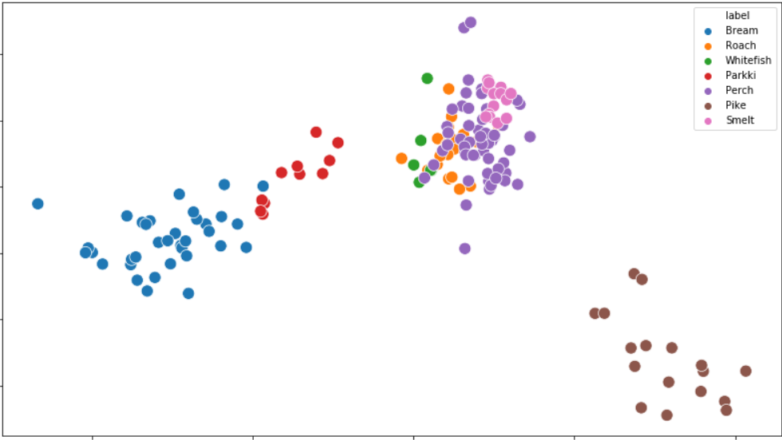
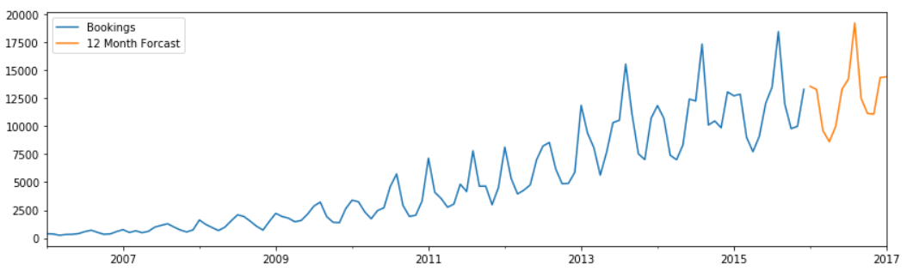
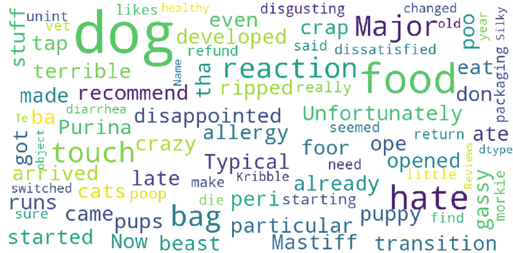

## Portfolio

---

### Dealing with Unlabeled Data 
[Project 1: K-Means Clustering with Python](/KM/KMeans.html)

---
### Time Series Analysis
[Project 2: Demand Forecasting Model with Python](/TSA/TSA.html)

---
### Natural Language Processing 
[Project 3: Classification of Customer Reviews on a Product](/NLP/GitHub_NLP_P1.html)

---
### Deep Learning with TensorFlow 2.0 in Python
[Project 4: Image Classification with MNIST Dataset](/DL/DL_TF2.0_1.html)

---
### Exploratory Data Analysis and Visualization 
[Project 5: Gapminder Data Analysis with Python](/EDA/EDA.html)

---
### Tree-Based Methods 
[Project 6: Multi-Label Classification with Python](/CART/CART.html)

---
